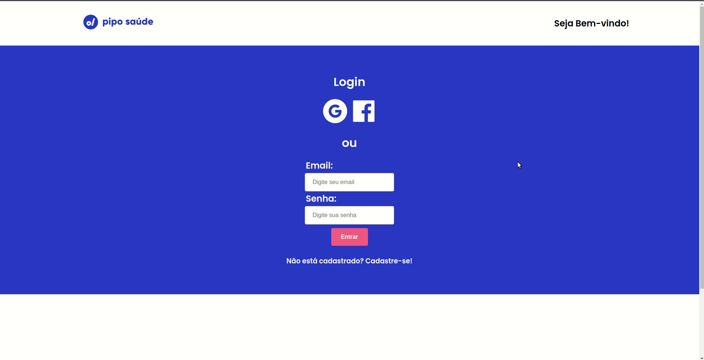

#  Pipo Saúde

   

 

<!-- 

   
   

 -->

---

## :pushpin: Table of Contents

-   [Technical Decisions](#technical-decisions)
-   [Features](#rocket-features)
    -   [Login](#computer-login)

## Technical Decisions

### Representative Diagram:

   

### Tech

#### To solve this problem I used ReactJS on the front-end and Node.JS on the backend. The reason behind this decision is that right now React is one of the most popular frameworks / libraries with extensive documentation on the internet, so that's my pick. Following the Javascript line, to take advantage of the knowledge, we are left with the decision of Nodej.JS. As for the database, we will use MongoDB, because, although at the moment there are not many customers, as stated in the statement of the exercise, it is important to take into account that Pipo is constantly growing and a non-relational database as MongoDB provides us with high availability, built-in fragmentation and cloud computing. To support the database decision, check this [link](https://medium.com/@rsk.saikrishna/when-to-use-mongodb-rather-than-mysql-d03ceff2e922odos(https://medium.com/@rsk.saikrishna/when-to-use- mongodb-rather-than-mysql-d03ceff2e922)

## :rocket: Features

### :computer: Login

 

   

